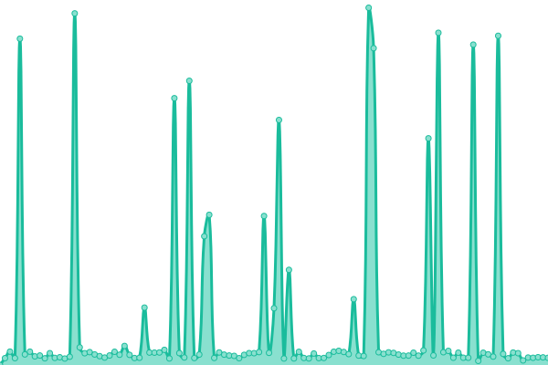
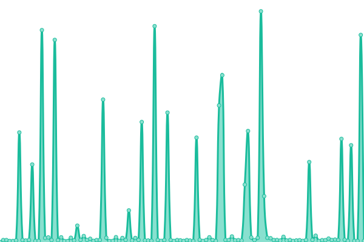

# [📈 Live Status](https://status.thetrident.one): <!--live status--> **🟩 All systems operational**

This repository contains the open-source uptime monitor and status page for [Trident](https://status.thetrident.one), powered by [Upptime](https://github.com/upptime/upptime).

With [Upptime](https://upptime.js.org), you can get your own unlimited and free uptime monitor and status page, powered entirely by a GitHub repository. We use [Issues](https://github.com/Trident/upptime/issues) as incident reports, [Actions](https://github.com/Trident/upptime/actions) as uptime monitors, and [Pages](https://status.thetrident.one) for the status page.

<!--start: status pages-->
<!-- This summary is generated by Upptime (https://github.com/upptime/upptime) -->
<!-- Do not edit this manually, your changes will be overwritten -->
<!-- prettier-ignore -->
| URL | Status | History | Response Time | Uptime |
| --- | ------ | ------- | ------------- | ------ |
|  [Trident](https://thetrident.one) | 🟩 Up | [trident.yml](https://github.com/TheTridentOne/upptime/commits/HEAD/history/trident.yml) | 

 277ms
     
 | 

<a href="https://status.thetrident.one/history/trident">100.00%</a>
    

|  [Trident API](https://thetrident.one/api) | 🟩 Up | [trident-api.yml](https://github.com/TheTridentOne/upptime/commits/HEAD/history/trident-api.yml) | 

 144ms
     
 | 

<a href="https://status.thetrident.one/history/trident-api">100.00%</a>
    

|  [Trident Docs](https://docs.thetrident.one) | 🟩 Up | [trident-docs.yml](https://github.com/TheTridentOne/upptime/commits/HEAD/history/trident-docs.yml) | 

 301ms
     
 | 

<a href="https://status.thetrident.one/history/trident-docs">100.00%</a>
    

|  [Trident Assistant](https://assistant.thetrident.one) | 🟩 Up | [trident-assistant.yml](https://github.com/TheTridentOne/upptime/commits/HEAD/history/trident-assistant.yml) | 

 743ms
     
 | 

<a href="https://status.thetrident.one/history/trident-assistant">100.00%</a>
    

<!--end: status pages-->

[**Visit our status website →**](https://status.thetrident.one)

## 📄 License

- Powered by: [Upptime](https://github.com/upptime/upptime)
- Code: [MIT](./LICENSE) © [Trident](https://status.thetrident.one)
- Data in the `./history` directory: [Open Database License](https://opendatacommons.org/licenses/odbl/1-0/)
